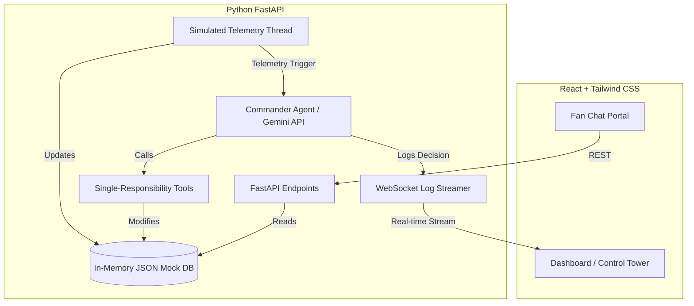

# StadiumOS 🏟️

**StadiumOS** is an agentic GenAI control tower for FIFA World Cup 2026 stadium operations. It acts as an autonomous operational brain that monitors live stadium telemetry (crowd density, gate queue wait times, and shuttle/train transit statuses) and takes proactive, real-time actions using Gemini API's native function calling.

## 🎯 The Chosen Vertical: Real-time Operational Intelligence
In high-stakes sports operations like the FIFA World Cup, traditional dashboards are passive and depend entirely on human operators reading metrics and manual coordination. **StadiumOS** addresses this by introducing an autonomous orchestrator. The agent reasons over IoT/CCTV sensor telemetry, identifies issues (e.g. gate bottlenecks, accessibility requests, transit delays), and executes tools in real-time while streaming its full decision trace to a central command dashboard.

---

## 🏗️ Architectural Choice: Orchestrator + Tools vs. Plain Chatbot

| Feature | Plain Chatbot | StadiumOS Agentic Orchestrator |
|:---|:---|:---|
| **Interaction** | Passive (only responds when spoken to). | Active (evaluates telemetry ticks autonomously). |
| **Data Access** | Static or limited to user chat context. | Direct access to stadium and transport data feeds via tools. |
| **Actionability**| Cannot affect the real world. | Takes concrete actions (rerouting fans, dispatching assistance, logging sustainability measures). |
| **Multilingual** | Translates chat messages on the fly. | Translates public stadium displays and coordinates localized broadcasts. |

### System Architecture Diagram


---

## ⚡ Key Capabilities: Human-in-the-Loop & Predictive Intelligence

### 1. Human-in-the-Loop (HITL) Action Approvals
StadiumOS splits tools into two categories:
*   **READ Tools**: `get_zone_status`, `get_all_zones_summary`, and `get_transport_status` execute immediately without restrictions.
*   **ACTION Tools**: `reroute_fans`, `send_multilingual_alert`, `flag_accessibility_need`, and `log_sustainability_action` require explicit staff approval.
*   **Proposals Flow**: When the agent wants to trigger an ACTION tool, the request is intercepted. A pending proposal is cached on the backend and pushed to the Control Tower UI via WebSockets.
*   **Interactive Cards**: Proposals appear at the top of the AI Decision Log with an amber pulsing border, a detailed reasoning block, and action parameters. Operators can click **Approve** (executes tool and logs execution) or **Override/Dismiss** (discards proposal).
*   **Auto-Timeout Toggle**: The dashboard includes an option to toggle `Auto-Approve (30s)`. When active, critical safety proposals automatically execute after 30 seconds of inactivity (logged as an auto-approval).

### 2. Trend-Based Predictive Alerts
*   **Rolling History**: The backend maintains a sliding window of the last 6 telemetry ticks per zone.
*   **Rate-of-Change Calculations**: Calculates the average crowd density delta per tick. This rate-of-change trend matrix is injected into the agent's prompts alongside the current snapshot.
*   **Trajectory-Based Triggers**: If a zone is under the critical 75% limit (e.g. 68%) but rising at a rate (e.g. +4%/tick) projecting it will breach the limit within 3 ticks, the system generates a **Predictive Occupancy Alert** trigger.
*   **Visual Log Tags**: Logs and pending cards are clearly tagged as `🔮 PREDICTIVE` (preventative foresight action) or `🚨 REACTIVE` (reacting to a current incident or breach).

---

## 🛠️ Project Setup

### Prerequisites
- Python 3.9+
- Node.js v18+
- A Gemini API Key (Optional: falling back to rule-based mock agent mode if not provided).

### 1. Environment Configuration
Copy the `.env.example` file to `.env` in the root folder:
```bash
cp .env.example .env
```
Open `.env` and fill in your Gemini API key:
```env
GEMINI_API_KEY=your_actual_gemini_api_key_here
TELEMETRY_TICK_RATE=10
```

### 2. Backend Installation & Start
```bash
# Create python virtual environment
python3 -m venv venv

# Activate virtual environment
source venv/bin/activate

# Install requirements
pip install -r backend/requirements.txt

# Start backend server
python3 backend/run.py
```
The backend API server will run at `http://localhost:8000`.

### 3. Frontend Installation & Start
Open a new terminal tab:
```bash
# Navigate to frontend folder
cd frontend

# Install node dependencies
npm install

# Start Vite React dev server
npm run dev
```
The React dashboard will run at `http://localhost:5173`. Open your browser and navigate to:
- Control Tower: [http://localhost:5173/control-tower](http://localhost:5173/control-tower)
- Fan Portal: [http://localhost:5173/fan](http://localhost:5173/fan)

### 4. Running Backend Tests
Execute the unit test suite inside the root directory:
```bash
./venv/bin/python3 -m pytest backend/tests/
```

---

## ⚡ Worked Example: Telemetry Spike -> Agent Decision Trace

1.  **Rising Trend**: A zone's crowd density rises steadily over successive ticks: 50% $\to$ 58% $\to$ 66% $\to$ 74%.
2.  **Predictive Trigger Detected**: The telemetry processor calculates a $+8.0\%/\text{tick}$ trend, projecting a critical breach in $\approx 0.1$ ticks. It fires a `Predictive Occupancy Alert` to the agent.
3.  **Agent Reasoning**: The agent decides to take preventative action before the limit is crossed.
4.  **HITL Interception**: The agent requests `reroute_fans()`. The backend intercepts it, generates a pending proposal, and pushes it to the UI.
5.  **UI Interaction**: A `🔮 PREDICTIVE PROPOSAL` card is displayed at the top of the feed. The operator reviews it and clicks **Approve**.
6.  **Tool Execution**: The tool executes. The decision log is appended with a `[APPROVED BY STAFF]` header.

---

## 🔍 Assumptions Made
1. **Telemetry Streams**: The simulated telemetry loop stands in for real-time CCTV crowd counting software and IoT gate sensors.
2. **Databases**: Simple file-locked JSON files under `backend/data/` act as an in-memory database suitable for prototyping.
3. **Languages**: Translations for standard safety broadcasts are mapped inside the `send_multilingual_alert` tool, representing a connection to an enterprise translation localization dictionary.
4. **Mock Agent Mode**: If `GEMINI_API_KEY` is not present, the system defaults to local heuristic logic to allow immediate out-of-the-box evaluation.
